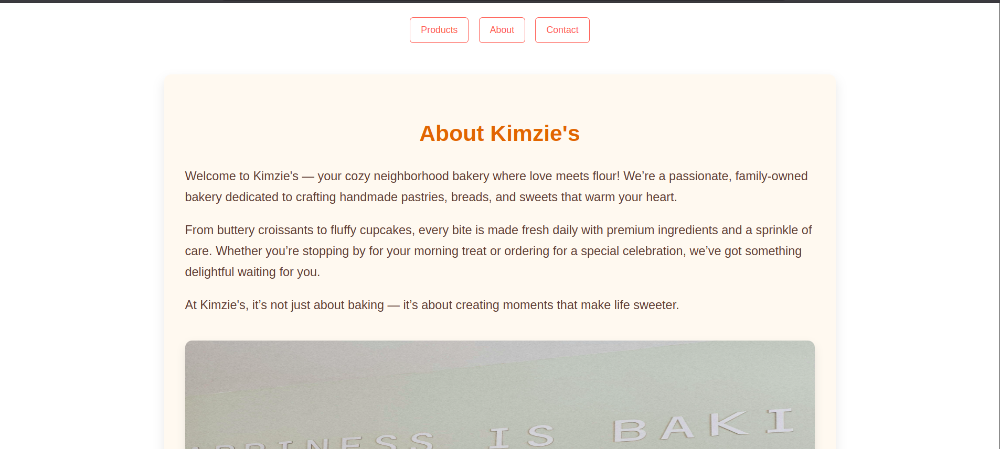

# 🥐 Kimzie's Bakery Website

Welcome to **Kimzie's Bakery** — a cozy, family-owned bakery website showcasing our handmade pastries, breads, and sweets. This project is a front-end implementation of a responsive bakery site using HTML, CSS, and JavaScript.

## 🌟 Features

- **Responsive Navigation** with smooth scrolling
- **Tabbed Interface** for switching between sections
- **Hero Banner** with a special offer modal
- **Interactive Gallery** with styled images
- **About Section** with quote and image
- **FAQs Accordion**
- **Contact Form** with validation (name, email, password)
- **Double-click Surprise** with Font Awesome gift icon
- **Font Awesome Icons** for modern visual flair

## 🚀 Technologies Used

- HTML5
- CSS3 (Flexbox, transitions, animations)
- JavaScript (DOM manipulation & events)
- Font Awesome (icons)
- Responsive design techniques

## 🛠️ Setup Instructions

1. Clone the repository:
   ```bash
   git clone https://github.com/kimaka254/plp-js-event-assignment.git

2. 🖥️ How to View

- Open `index.html` in your browser to view the site.

---

## 🎁 Special Features

- ✨ **Double-click gift modal** that appears with a fun message.
- 🖱️ **Hover & keypress detection** built-in.
- ✅ **Real-time form validation** with user feedback.

---

## 📸 Screenshot



---

## 💡 Author

**Elsy Kimaka**  
📧 [Email](mailto:elsykimaka02@gmail.com)  
🔗 [LinkedIn](https://linkedin.com/in/elsykimaka)  

